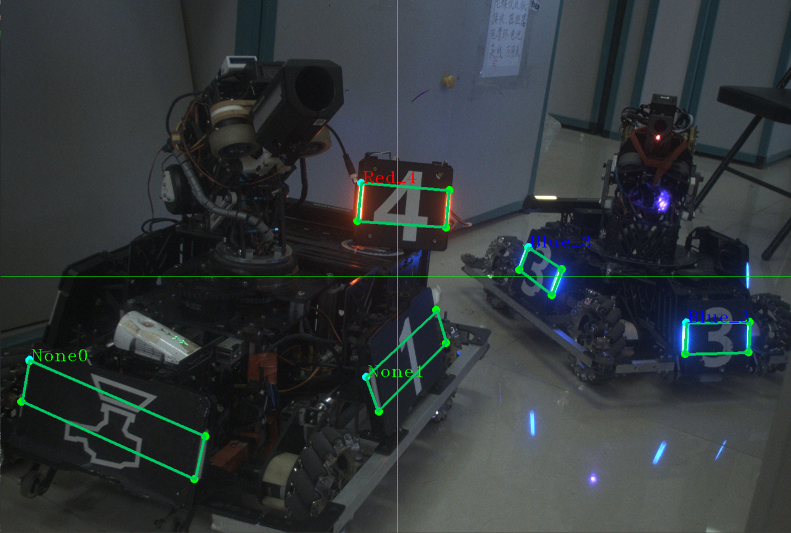

## YolovX-Face -- OpenVINO 装甲板四点检测 (iGPU)

### 特别致谢：
`沈阳航空航天大学` 视觉开源项目团队！

https://github.com/tup-robomaster/TUP-InfantryVision-2022.git

### 一、项目说明
本项目实现了以下内容：
* 端到端的推理，输入图像，输出装甲板信息(坐标、四点、类别等)
* 有效识别 部分遮挡、图案残缺 的装甲板
* 场景泛化性强，极大减少参数调试压力

### 二、工作条件
务必保证摄像头焦距正确，同时镜片干净无污物。
光照不足时，调整摄像头曝光或增益数值，直到图案有区分度。

### 三、测试用例
> 运算设备：Intel NUC 10i5 (iGPU)
> 
> 网络输入尺寸: 412 X 412 X 3
> 
> 推理平均耗时: 9~11ms

### 四、环境要求
* [OpenVINO 2021 及以上版本(带 OpenCV 4.X)](https://docs.openvino.ai/cn/latest/get_started.html)
* [海康机器人相机SDK](https://www.hikrobotics.com/cn/machinevision/service/download)
* [Yaml-cpp](https://github.com/jbeder/yaml-cpp)
